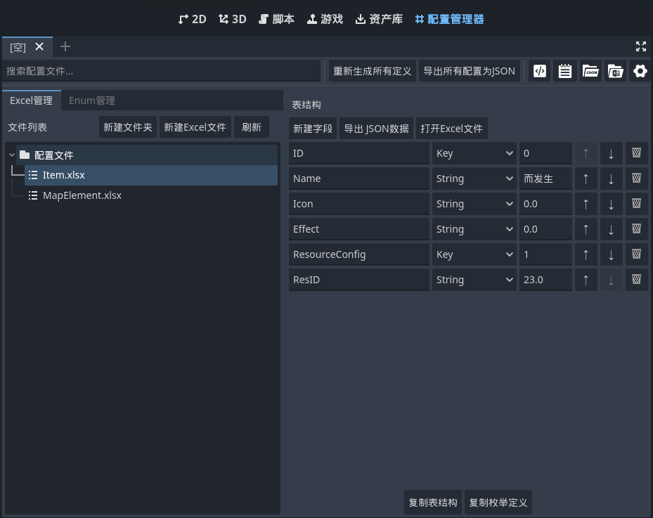
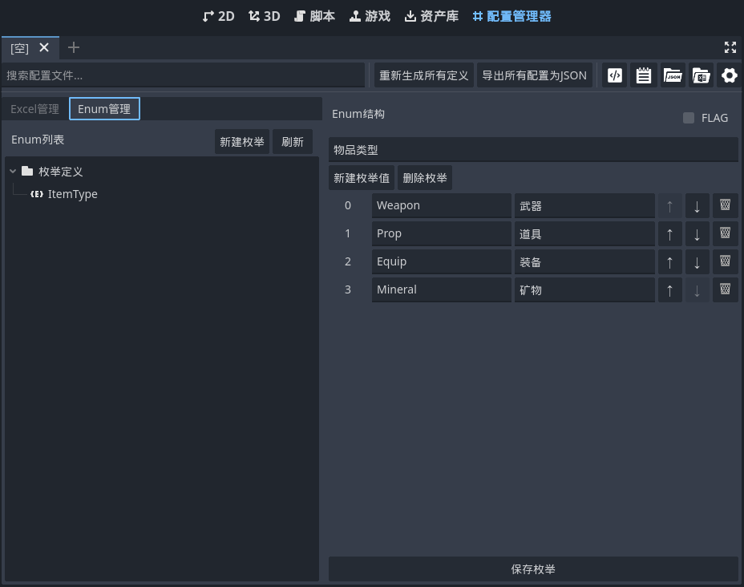

# 配置管理器插件 (Config Manager)

Godot 4.x 配置文件管理工具，支持从 Excel 文件自动生成类型安全的配置代码和 JSON 数据。

本工具依赖 https://github.com/LaoDie1/godot-excel-reader
## 插件原理

### 核心架构

配置管理器插件采用"Excel → 类定义 → JSON 数据"的三阶段工作流程：

1. **Excel 解析层**：读取 Excel 文件的结构定义，解析字段类型、枚举、默认值等信息
2. **代码生成层**：根据 Excel 结构自动生成类型安全的 GDScript 类定义和数据管理器
3. **数据加载层**：将 Excel 数据导出为 JSON 格式，并通过统一的数据管理器进行访问

### 工作原理

#### Excel 结构定义
Excel 文件的前三行具有特殊含义：
- **第1行**：字段名称 (如：ID, Name, Level, Type)
- **第2行**：字段类型 (如：KEY, String, int, Enum:ItemType)
- **第3行**：默认值 (可选)
- **第4行开始**：实际数据

#### 支持的数据类型
- **基本类型**：`String`, `StringName`, `int`, `float`, `bool`
- **向量类型**：`Vector2`, `Vector2i`, `Vector3`, `Vector3i`
- **数组类型**：`Array[int]`, `Array[float]`, `Array[String]`
- **枚举类型**：`Enum:EnumName`
- **键类型**：`KEY` (用于标识主键和子键)

#### 代码生成机制
插件会自动生成以下文件：
- `table_classes.gd`：包含所有表的类定义
- `data_manager.gd`：统一的数据访问管理器
- `enums.gd`：枚举定义文件
- `*.json`：导出的 JSON 数据文件

## 使用说明

### 1. 插件安装和激活

1. 将 `config_manager` 文件夹放入项目的 `addons/` 目录
2. 在项目设置中启用"配置管理器"插件
3. 重启 Godot 编辑器
4. 在编辑器顶部会出现"配置管理器"标签页

### 2. 编辑器界面说明

配置管理器的主界面分为以下几个区域：

#### 工具栏
- **搜索框**：搜索配置文件（暂时保留，功能待完善）
- **重新生成所有定义**：扫描所有 Excel 文件并重新生成类定义
- **导出所有配置为JSON**：将所有 Excel 文件导出为 JSON 格式
- **打开类定义文件** (代码图标)：在脚本编辑器中打开 `table_classes.gd`
- **打开枚举定义文件** (记事本图标)：在脚本编辑器中打开 `enums.gd`
- **打开JSON文件夹** (JSON图标)：在系统文件管理器中打开 JSON 导出目录
- **打开Excel文件夹** (Excel图标)：在系统文件管理器中打开 Excel 配置目录
- **配置设置** (齿轮图标)：打开路径配置对话框

#### 左侧面板
包含两个标签页：

**Excel管理**


- **文件列表**：显示配置目录下的所有 Excel 文件和文件夹
- **新建文件夹**：在当前目录创建新文件夹
- **新建Excel文件**：从模板创建新的 Excel 配置文件
- **刷新**：重新扫描文件列表

**表结构视图**（选中Excel文件时）
- **字段列表**：显示当前表的所有字段定义
- **新建字段**：添加新的字段定义
- **导出JSON数据**：导出当前表的 JSON 数据
- **打开Excel文件**：用系统默认程序打开 Excel 文件
- **复制表结构**：将表结构复制到剪贴板（可直接粘贴到Excel）
- **复制枚举定义**：复制当前表使用的枚举定义

**Enum管理**


- **枚举列表**：显示所有已定义的枚举
- **新建枚举**：创建新的枚举定义
- **刷新**：重新加载枚举列表

**枚举属性视图**（选中枚举时）
- **FLAG复选框**：是否为位标志枚举
- **枚举描述**：枚举的描述信息
- **新建枚举值**：添加新的枚举值
- **删除枚举**：删除当前枚举（需确认未被使用）
- **保存枚举**：保存枚举修改

### 3. Excel 文件规范

#### 文件结构要求

**基本表结构示例**
```
第1行：ID        Name         Level    Type         Effect
第2行：KEY       String       int      Enum:ItemType Array[String]
第3行：0         默认名称      1        Equipment     []
第4行：1001      生命药水      5        Potion        ["恢复生命值", "持续效果"]
第5行：1002      魔法药水      3        Potion        ["恢复魔法值"]
```

**包含 FLAG 枚举的表结构示例**
```
第1行：ID        Name         Elements     Damage    Cost
第2行：KEY       String       Enum:SkillFlags int      int
第3行：0         默认技能      Fire         100       10
第4行：001       火球术        Fire         150       15
第5行：002       冰火术        Fire|Water   200       25
第6行：003       元素爆发      Fire|Water|Earth|Air 500 100
```

#### 字段类型说明
- **KEY**：主键字段，用于数据索引
- **String/StringName**：文本类型
- **int/float**：数值类型
- **bool**：布尔类型，支持 true/false, 1/0, yes/no
- **Vector2/Vector3**：向量类型，格式："x,y" 或 "x,y,z"
- **Vector2i/Vector3i**：整数向量类型
- **Array[Type]**：数组类型，元素用逗号分隔
- **Enum:EnumName**：枚举类型，需要先定义枚举

#### 多键表支持
支持主键+子键的表结构：
```
第1行：ItemID   SubID    ResourceType  Amount
第2行：KEY      KEY      String        int
第3行：         配置     类型          数量
第4行：1001     Gold     Currency      100
第5行：1001     Silver   Currency      50
第6行：1002     Wood     Material      10
```

### 4. 枚举定义

#### 创建枚举
1. 在左侧"Enum管理"标签页点击"新建枚举"
2. 输入枚举名称
3. 在右侧面板设置枚举属性：
   - 是否为 FLAG 枚举（位标志）
   - 添加枚举值和描述
4. 点击"保存枚举"

#### 枚举类型
- **普通枚举**：连续整数值 (0, 1, 2, 3...)
- **FLAG枚举**：2的幂次方值 (1, 2, 4, 8, 16...)，支持位运算

#### 枚举值的填写方式

**普通枚举**
在 Excel 中直接填写枚举值名称：
```
字段类型：Enum:ItemType
数据填写：Weapon, Armor, Potion
```

**FLAG 枚举**
支持多种填写方式：
```
字段类型：Enum:SkillFlags (FLAG枚举)
数据填写方式：
- 单个值：Fire
- 多个值：Fire|Water|Earth
- 混合使用：Fire|Water, Earth|Air
```

FLAG 枚举的位运算示例：
```
定义：Fire=1, Water=2, Earth=4, Air=8
填写：Fire|Water|Earth
实际值：1|2|4 = 7
```

### 5. 全局配置

#### 设置路径
点击工具栏的"配置设置"按钮，可以配置：
- **Excel根路径**：Excel 配置文件的存放目录
- **类定义输出路径**：生成的类文件存放目录  
- **JSON导出路径**：JSON 数据文件的导出目录
- **枚举文件路径**：枚举定义文件的存放目录

#### 添加全局自动加载
生成代码后，需要将 `data_manager.gd` 添加为全局自动加载：

1. 打开 **项目 → 项目设置 → 自动加载**
2. 路径设置为：`res://Scripts/ConfigClasses/data_manager.gd`
3. 节点名称设置为：`DataManager`
4. 确保"启用"复选框被勾选
5. 点击"添加"

### 6. 业务代码中的使用

#### 基本数据访问
```gdscript
# 通过键获取物品数据
var item_data = DataManager.get_Item("1001")
if item_data:
    print("物品名称：", item_data.Name)
    print("物品图标：", item_data.Icon)
    print("物品效果：", item_data.Effect)

# 访问多键表数据（如果有子键）
if item_data.ResourceConfig.has("Gold"):
    var resource_data = item_data.ResourceConfig["Gold"]
    print("资源ID：", resource_data.ResID)
```

#### 遍历所有数据
```gdscript
# 遍历所有物品
for item_id in DataManager.Item.keys():
    var item = DataManager.Item[item_id]
    print("物品 %s: %s" % [item_id, item.Name])
```

#### 条件查询
```gdscript
# 查找指定等级的物品
func find_items_by_level(target_level: int) -> Array[TableClasses.Dt_Item]:
    var result: Array[TableClasses.Dt_Item] = []
    for item in DataManager.Item.values():
        if item.Level == target_level:
            result.append(item)
    return result

#### 枚举类型的使用

**普通枚举**
```gdscript
# 使用枚举进行筛选
func find_items_by_type(item_type: ItemType) -> Array[TableClasses.Dt_Item]:
    var result: Array[TableClasses.Dt_Item] = []
    for item in DataManager.Item.values():
        if item.Type == item_type:
            result.append(item)
    return result

# 枚举值比较
var item = DataManager.get_Item("1001")
if item.Type == ItemType.Weapon:
    print("这是一件武器")
```

**FLAG 枚举**
```gdscript
# 假设技能系统有 FLAG 枚举：SkillFlags
# Fire=1, Water=2, Earth=4, Air=8
# Excel中填写 "Fire|Water" 会被解析为整数值 3

# 检查是否包含特定标志
var skill = DataManager.get_Skill("skill_001")
if skill.Elements & SkillFlags.Fire:
    print("技能包含火属性")

# 检查是否包含多个标志
if (skill.Elements & SkillFlags.Fire) and (skill.Elements & SkillFlags.Water):
    print("技能同时包含火属性和水属性")

# 更简洁的写法
var fire_and_water = SkillFlags.Fire | SkillFlags.Water
if (skill.Elements & fire_and_water) == fire_and_water:
    print("技能同时包含火属性和水属性")

# 获取所有包含的标志
func get_skill_elements(skill_flags: int) -> Array[String]:
    var elements: Array[String] = []
    if skill_flags & SkillFlags.Fire:
        elements.append("火")
    if skill_flags & SkillFlags.Water:
        elements.append("水")
    if skill_flags & SkillFlags.Earth:
        elements.append("土")
    if skill_flags & SkillFlags.Air:
        elements.append("风")
    return elements
```

#### 数据验证
```gdscript
# 检查物品是否存在
func item_exists(item_id: String) -> bool:
    return DataManager.get_Item(item_id) != null

# 安全获取数据
func get_item_name(item_id: String) -> String:
    var item = DataManager.get_Item(item_id)
    return item.Name if item else "未知物品"
```

## 工作流程示例

### 完整的配置开发流程

1. **准备 Excel 文件**
   ```
   文件位置：res://Configs/Items.xlsx
   内容：物品配置表
   ```

2. **定义枚举**（如果需要）
   
   **普通枚举示例**
   - 在插件中创建 `ItemType` 枚举
   - 添加值：`Weapon=0`, `Armor=1`, `Potion=2`
   
   **FLAG 枚举示例**
   - 在插件中创建 `SkillFlags` 枚举（勾选 FLAG 选项）
   - 添加值：`Fire=1`, `Water=2`, `Earth=4`, `Air=8`

3. **编辑 Excel 文件**
   
   **普通枚举使用**
   ```
   A1: ID      B1: Name       C1: Type         D1: Price
   A2: KEY     B2: String     C2: Enum:ItemType D2: int
   A3:         B3: 默认物品    C3: Weapon       D3: 0
   A4: 1001    B4: 铁剑       C4: Weapon       D4: 100
   A5: 2001    B5: 皮甲       C5: Armor        D5: 80
   ```
   
   **FLAG 枚举使用**
   ```
   A1: ID      B1: Name       C1: Elements        D1: Damage
   A2: KEY     B2: String     C2: Enum:SkillFlags D2: int
   A3:         B3: 默认技能    C3: Fire           D3: 0
   A4: 001     B4: 火球术      C4: Fire           D4: 150
   A5: 002     B5: 冰火术      C5: Fire|Water     D5: 200
   A6: 003     B6: 全元素      C6: Fire|Water|Earth|Air D6: 500
   ```

4. **生成代码**
   - 点击"重新生成所有定义"
   - 检查生成的 `table_classes.gd`

5. **导出数据**
   - 点击"导出所有配置为JSON"
   - 检查生成的 `Items.json`

6. **配置自动加载**
   - 添加 `data_manager.gd` 为全局脚本

7. **在代码中使用**
   
   **普通枚举使用**
   ```gdscript
   func use_item(item_id: String):
       var item = DataManager.get_Item(item_id)
       if item:
           print("使用物品：%s，价格：%d" % [item.Name, item.Price])
           if item.Type == ItemType.Weapon:
               print("这是一件武器")
   ```
   
   **FLAG 枚举使用**
   ```gdscript
   func cast_skill(skill_id: String):
       var skill = DataManager.get_Skill(skill_id)
       if skill:
           # skill.Elements 是整数值，如 Fire|Water 会被解析为 3
           print("技能：%s，伤害：%d" % [skill.Name, skill.Damage])
           
           # 检查技能元素
           if skill.Elements & SkillFlags.Fire:
               print("包含火属性")
           if skill.Elements & SkillFlags.Water:
               print("包含水属性")
               
           # 检查是否同时包含火和水
           var fire_water = SkillFlags.Fire | SkillFlags.Water
           if (skill.Elements & fire_water) == fire_water:
               print("同时包含火和水属性，造成额外伤害！")
   ```

## 注意事项

### Excel 文件编辑
- Excel 文件必须保存为 `.xlsx` 或 `.xls` 格式
- 字段名不能包含空格或特殊字符
- 枚举名称必须符合 GDScript 命名规范
- 修改 Excel 结构后需要重新生成代码

### 数据类型转换
- 字符串中的逗号会被识别为数组分隔符
- 布尔值支持多种格式：`true/false`, `1/0`, `yes/no`
- 向量类型使用逗号分隔坐标值

### 枚举使用注意事项
- **普通枚举**：Excel 中直接填写枚举值名称（如：`Weapon`, `Armor`）
- **FLAG 枚举**：支持位运算符 `|` 组合多个值（如：`Fire|Water|Earth`）
- **实际存储**：枚举在代码中以整数形式存储，FLAG 枚举是位运算后的结果
- **类型检查**：业务代码中需要使用位运算符 `&` 检查 FLAG 枚举的包含关系
- **枚举定义顺序**：修改枚举顺序会影响数值，请谨慎操作
- **删除限制**：被 Excel 文件引用的枚举无法删除，需先移除所有引用

### 性能考虑
- 数据在游戏启动时一次性加载到内存
- 大量数据建议分表存储
- 频繁访问的数据可以考虑缓存

### 版本兼容性
- 插件专为 Godot 4.x 设计
- 不支持 Godot 3.x
- 生成的代码严格遵循 Godot 4.x API

## 故障排除

### 常见问题

**Q: 生成的类文件为空或不完整**
A: 检查 Excel 文件格式是否正确，确保前两行包含字段名和类型定义

**Q: 枚举类型无法识别**  
A: 确保枚举已在插件中定义，并且 Excel 中使用正确的 `Enum:EnumName` 格式

**Q: JSON 数据导出失败**
A: 检查 Excel 文件是否被其他程序占用，确保文件路径正确

**Q: 自动加载的 DataManager 找不到**
A: 确认 `data_manager.gd` 文件已生成，并正确添加到项目的自动加载列表

**Q: 数据加载失败**
A: 检查 JSON 文件是否存在，路径配置是否正确

### 调试建议
- 使用编辑器的输出面板查看详细错误信息
- 检查生成的代码是否有语法错误
- 确认项目设置中的路径配置正确
- 重启 Godot 编辑器以刷新插件状态

